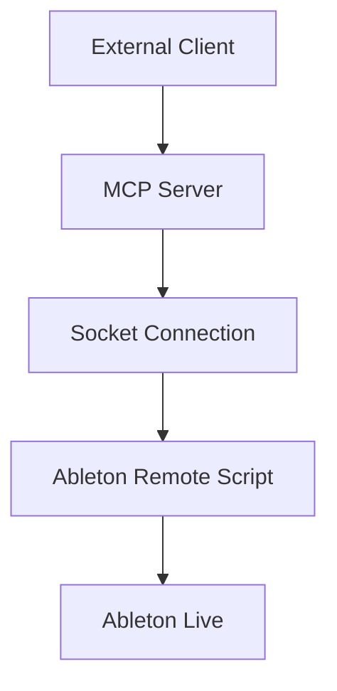
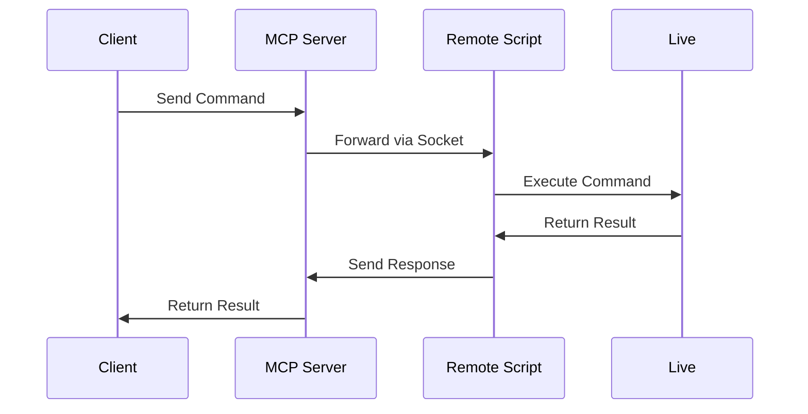

# System Patterns

## Architecture Overview

### Component Structure

### Communication Flow

## Design Patterns

### Command Pattern
- Commands are JSON objects with type and parameters
- Each command maps to a specific handler function
- Consistent response format for success/error

### Thread Safety
- Server uses thread pool for client connections
- Main thread handles Live API interactions
- Queue-based communication for thread synchronization

### Error Handling
- Hierarchical error handling
- Detailed error messages and logging
- Graceful connection recovery

### Connection Management
- Persistent socket connections
- Automatic reconnection
- Connection state monitoring

## Technical Decisions

### Socket Communication
- TCP/IP for reliable delivery
- JSON for message serialization
- Chunked message handling for large payloads

### Threading Model
- Main thread for Live API calls
- Worker threads for client connections
- Background thread for connection monitoring

### State Management
- Live state accessed via Remote Script
- Cached references to common objects
- Lazy loading of browser items

### Error Recovery
- Connection retry with backoff
- Command timeout handling
- Graceful degradation 